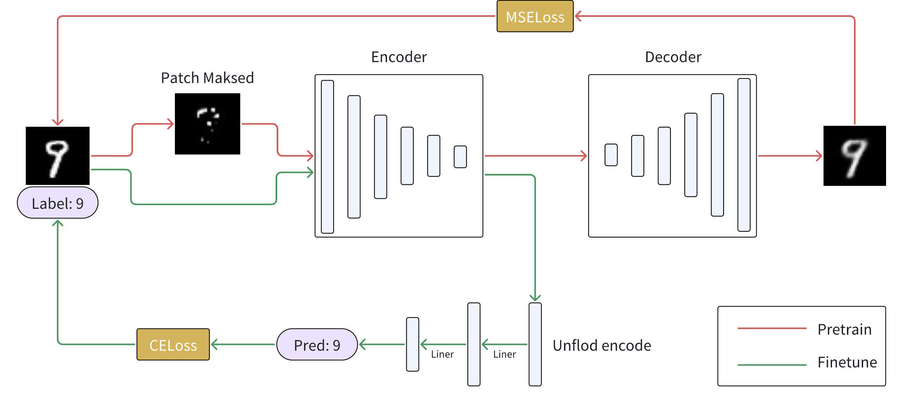
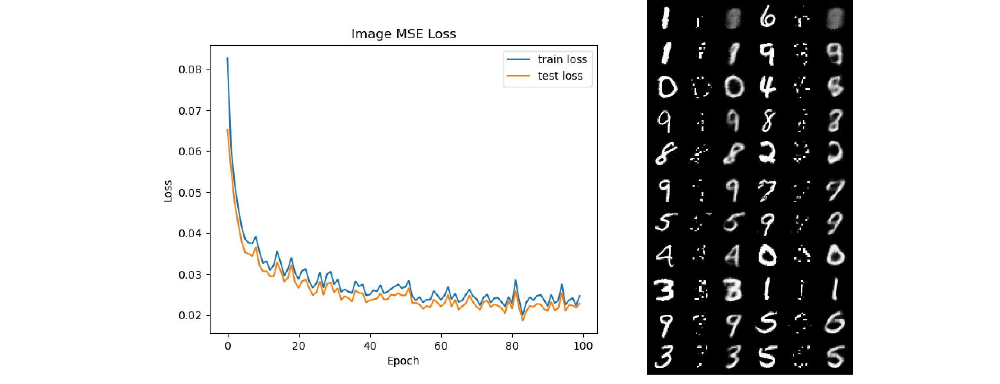
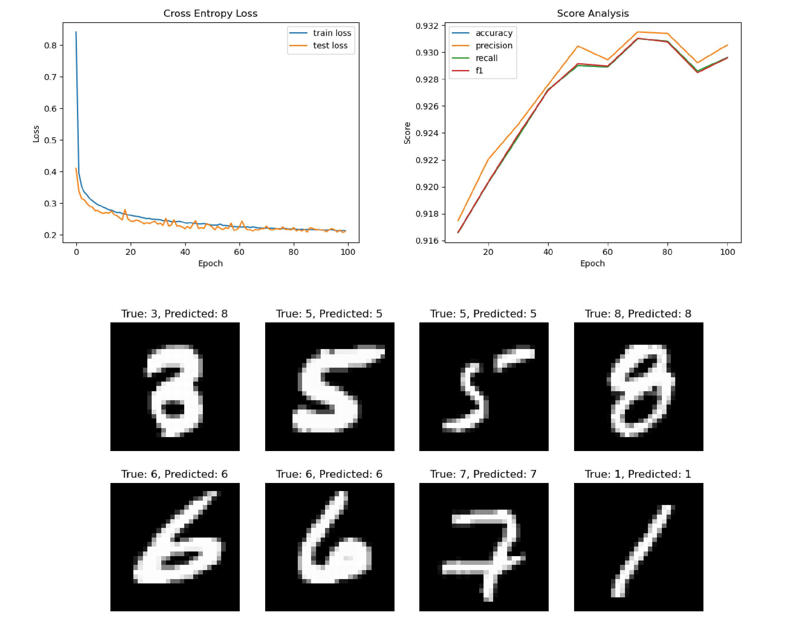

# CNN_Masked_Autoencoder

This repository focuses on a masked autoencoder based on a Convolutional Neural Network (CNN). Initially, it is used for self-supervised learning to extract features from the MNIST dataset by reconstructing masked images. Subsequently, the encoder of the network is employed for downstream classification tasks. After fine-tuning, it yields remarkable results.

## Model Structure 



The design involves two stages of work. In the first stage, the model masks the input image and pretrains an autoencoder to reconstruct it. In the second stage, a pretrained encoder is used to encode the full image, with its parameters frozen, and a classification network is trained.

## Work Display

**Pretrain the masked autoencoder moedel 100 epochs, save the loss curve and visualize reconstruction process.**     

**Finetune the pretrain encoder, save the loss and model score curve. Show a model classify sample.**  


## Usage

```python
cd CNN_Masked_Autoencoder
pip install -r requirements.txt
python pretrain.py
python finetune.py
python analyze.py
```

**NOTE:**  

1. It will auto download the dataset.
2. Model will save in `./ckpt/pretrain` and `./ckpt/finetune`.
3. In `./figure` floder you can see analyze img.

## Idea From

<https://arxiv.org/abs/2111.06377>
